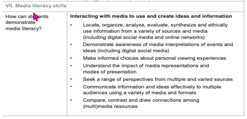
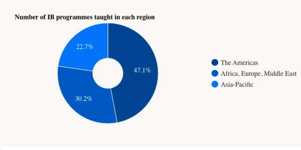

This is a paper that I wrote as part of my doctoral program at Wilkes and I wanted to share it.

**Introduction**

The Global Education Monitoring Report 2020 addresses the pressing issue of
inclusivity in education. One clear recommendation was the idea of adapting a curriculum
that is “…relevant, flexible and responsive to needs” (p. 17). The report recognizes that we
live in a world that aligns its curriculum with privilege and certain types of knowledge. The
report highlights the bias in many curriculums within rural and urban areas, the use of
textbooks, and the effect of language use in schools. Therefore, it is of utmost importance
that we examine our 21st
-century curriculum and work to find a way that it can adapt to our
ever-changing world. One way we might be able to mitigate some of the biases is to embrace
a more inquiry, concepts, and skills-based focus over simply delivering content that might not
apply to all.

**Part I: The Problem**

With the onset of COVID-19 in 2020, education practices changed at a rapid pace.
Teachers and students went from attending school in a traditional bricks-and-mortar setting to
teaching remotely in an online environment. This massive shift served as an important
reminder that it might be time to examine some of the traditional practices we may use in our
everyday classrooms. At the same time, it served as an essential reminder of the inequity
within the educational system today. Hampson et al. (2021) point out that

> > As children grow older, they become less and less engaged in school – when one would hope that the reverse would be true. And this is a bigger problem for the most disadvantaged students, who consistently show lower levels of engagement. (Para. 3).

Therefore, it becomes the job of educators to find innovative solutions to engage all of our
students regardless of wealth or status. The Global Risk Report 2022 re-iterates that COVID -
19 has damaged the social cohesion in countries to detrimental levels and perceived it as a critical threat that will damage our world. The report highlights that over the next ten years,
the lack of social cohesion will cause more significant disparity and inequality that will affect
the "-economic, political, technological, and intergenerational- generational—which was
already challenging societies even before income disparities increased through the pandemic.
These disparities are now expected to widen further” (p.16).

The world has changed. Over the past three years, students have been irrevocably
changed by the onset of COVID-19, which leaves us in a complex world with many
problems. Learning that may have been applicable or relevant in the past does not always
apply today. If we want to create problem- solvers who will address the issues we are facing
today, then we must address what we teach our children in schools. Erickson (2011) points
out that we live in a world that has moved from national to global. We have problems that
need solving on an international level from environmental, climate change, immigration and
emigration, conflicts with no resolutions, health problems, and the list continues to grow. The
skills that may have been required in the past are almost no longer applicable in today's
globalized world.

There is no doubt that the time for change is upon us. In this increasingly globalized
world, we need to teach our students to identify problems in the world and then begin to try
and determine solutions. There is an argument that using an inquiry, concept, and skills-based
curriculum would be a worthy goal for our schools today. Instead of focusing on content,
why not imagine a curriculum that uses concepts and skills to drive the curriculum?
According to Yarim et al. (2012) “In multi-stakeholder learning environments students are
argued to profit from being involved in real world transdisciplinary projects on multiple
scales, bridging the science-society gap, and applying various approaches and methods for
facing complex problems” (as cited in Oonk, p. 5, 2016). Therefore, if we focused on inquiry,
skills and concepts, we may be addressing the problems of inequality or content that is not
applicable to different groups. Problems that are happening in China will certainly differ
from those that are happening in Turkey, or perhaps not, but let us begin to involve our
students in the process. Hampson et al. (2020) maintain that with the introduction of
technology, there is no reason that each child cannot tailor their learning to a more
personalized and relevant way. The role of passion learning is meant to engage learners to
pursue whatever they are interested. This independent inquiry leads to the greater
engagement that we want for our students.

**Personal Relevance**

Balim (2016) created a study posited that inquiry or discovery-based learning affected
academic achievement, scores of retention of learning, and perception of inquiry learning
skills scores, both on cognitive and affective levels. This evidence helps to confirm what
some educators have always believed about the role of inquiry, concepts and skills in
education. As an International Baccalaureate (IB)- Middle Years Programme (MYP) teacher
since 2005, the belief in the mission and aims of the IB have helped to guide my passion for
inquiry and concept-based learning. Their mission states, “The International Baccalaureate
aims to develop inquiring, knowledgeable and caring young people who help to create a
better and more peaceful world through intercultural understanding and respect” (p. 3). As
someone who has developed units of inquiry based on this philosophy, I have had the
opportunity to see first-hand the difference that inquiry, skills, and concept-based learning
can have on students. One such instance occurred in Ho Chi- Minh, Vietnam, in 2014, where
a Grade 8 class created a KWL chart regarding Iran. The class completed some research on
the country prior to reading Marjane Satrapi’s Persepolis. One student raised his hand and
asked, "What I really want to know is how can one person influence so many others?” This
kind of deep thinking and questioning is vital in our world. Couldn't this question apply to a
variety of situations in history to today?

As someone who strives to lead with compassion and care, this is the time to examine
our curriculum and see how we can make it relevant to all learners regardless of where they
are, who they are, or how much money they have. As Abdullahi (2010) pointed out, "In the
twenty-first century, global educators deal with issues and problems caused by poverty,
globalization, global terrorism, and human and ecological abuses" (p.24). There is no doubt
that the last couple of years have been a challenge. We should continue educating children to
be positive citizens and problem solvers worldwide. To help parents understand that good
grades are great but being a good person is even better. As the IB points out in its mission, let
us use our education curriculum to support our children "…to become active, compassionate
and lifelong learners who understand that other people, with their differences, can also be
right” (p. 3).

**Significance of the Problem**

There are many facets to this problem. We are interested in aligning the curriculum to be
more inquiry, concepts, and skills-based. At the same time, we want an inclusive, engaging
curriculum that allows students to become solutions focused on the problems we are facing in
our world today. Wagner (2008) highlights this idea with his look at what he calls the
"Global Achievement Gap," which is essentially the disconnect between what is taught in
school and what students need to learn to succeed in our world today. These include critical
thinking, communication, collaboration, curiosity, and adaptability. Wagner (2007) highlights
the lack of real-world application in our current classrooms, and it is leading to the "gap" in
student achievement:

> > These issues were never discussed in any of the classrooms I observed. Some teachers I talked to wanted to have such conversations with their students. However, they felt obligated to spend all available class time covering the content needed to ensure that the students would pass various standardized tests (p. xvi).

In this way, the promotion of inclusivity occurs because we are not necessarily teaching the
content, instead, educators can focus on the concepts or skills. An example of this might be in
a history class; traditionally, a U.S. history class may linearly align itself beginning with
World War I. In a concept-based programme such as the IB- MYP, the teacher may begin
with the concept of conflict. They might look at this concept through the lens of a Global
Exploration of justice, peace, and conflict management or power and privilege. In the U.S.
they could undoubtedly use World War I as the content that aligns with the concept;
however, any country in the world could use the concept and Global Exploration to explore
content that might be more pertinent or pressing to explore in their classrooms. At the same
time, this allows students to analyse conflict. Instead of simply regurgitating and memorizing
facts, they can look at the problem, figure out what happened, and then begin to connect to
their own lives and the world around them. In turn, this may help them find real-world
solutions to conflicts in our world today. A concept-based curriculum does not mean that
there is no content; however, it means that the curriculum is no longer beholden to the
content but instead driven by the concepts. A concept-based curriculum is certainly not a new
idea. Piaget and Vygotsky (1936) related this idea directly to constructive learning theory, the
idea that learning is an active process that students need to play their part (as cited in ). It
cannot be passive but rather must be what Miller (2012) refers to as “transformative” (p.12).
The time is ripe for us to make a change in our curriculum. We can no longer use a contentbased curriculum that does not serve the needs of the 21st
-century learner. COVID-19 should
serve as a time for educational reform.

**Part II: Emergent Innovation**

There is no doubt that technology has changed the face of education. There is no need
for students to spend hours poring over the library card catalogue to find information about a
topic they want to research. Instead, today's students can find and access any information
they want with the click of a mouse. The advent of memorizing facts and then repeating them
for a quiz or test is only one way a student can showcase their knowledge. Wathall (2022), a
concept-based educator states that,

> > An explicit instruction method is a teacher-centered approach that often adopts a cycle of explaining, modelling, scaffolding and practising. I facetiously call this the monkey see monkey do technique. This transmission method of teaching stifles a learner’s ability to think independently, to be curious and creative (para. 4).

Therefore, technology can be essential in changing our curriculum and end goals. If, as
educators, we know that students can access any information they are interested in, then it
stands to reason that we have a responsibility to teach students the skills needed to evaluate
sources. At the same time, ensure that the information they are reading is credible. In this day
of "fake" news, now more than ever, we need to teach solid research skills (see figure 1). In
the IB- MYP these skills are called the Approaches to Learning. The Research Cluster
includes a section on media literacy that is relevant to students today.

If students can create their questions, determine their learning or even participate in guidedinquiry, we allow them the opportunity to become agents of their learning who feel
empowered. In turn, they can feel the joy from investigating what matters to them.

**Implementing Change**

For a change to occur in curriculum and education today, we would need a drastic rethink of what is valued in education today. With the advent of standardized testing, we would
need to move away from this kind of assessment and convince our stakeholders of the value
of inquiry, concepts, and skills. Changing to an inquiry model can play a role in creating
critical thinkers and problem solvers. At the same time helping to address inclusivity issues
within the curriculum. Change in education is arduous and long since this idea of promoting
inquiry over content is not new or novel, Taba (1932) stated,

> > The task of education, as understood at present, is to lead growing individuals to more and more intelligent, wide, well-organized, and rich forms of experience through guidance, through selection of subject matter, and by providing an environment which is stimulating to self-direction (as cited in Laanemets & Kalamees-Ruubel, 2013).

In Ontario, Canada, the Ministry of Education (2020) began using social-emotional learning
skills in the teaching of mathematics. The idea is that students will “develop confidence, cope
with challenges and think critically" (para. 3). Unfortunately, the current governmental
administration found this method to be unacceptable and demanded that the curriculum return
to “back to basics.” Back to Basics meant returning to how the curriculum was taught before
with drills, facts, and memorization. Therefore, before we can convince the relevant
stakeholders, politicians, teachers, administrators, and parents, we need more research and
data to support the idea that this is a better way for student learning. We need data like
Scruggs and Mastropieri (2009) who found that “when using inquiry-based learning in place
of a textbook approach in two science units, high school special needs students yielded
significantly higher achievement than their peers who used a textbook” (as cited in Caswell
& LaBrie, p. 17, 2017).

Although implementing change is challenging as Patterson (2016) points out “Change
has long been the most feared aspect of education. Regardless of its inevitability, each time
it’s met with the same disdain and hesitance as the last” (para.4). It is not entirely impossible.
With the advent of data-informed decision-making, there is undoubtedly room to start the
conversation for change within the curriculum. According to the IBO “there were over 7,500
programmes being offered worldwide, across over 5,500 schools in 160 countries" (para. 1).
There has also been a growth of schools by 33% since 2016. Since the IB offers an inquiry,
concepts, and skills-based programme, it does provide some hope.

Another change that would be an easy fix would be to rid the world of standardized testing.
High-stakes testing has certainly proven to be detrimental to students' emotional health and
well-being. Minarechová's research (2012) showed that tests were being used to hold schools
accountable. Unfortunately, in doing so, there were many problems for students that
negatively manifested, such as "…stress and tension in students, teachers’ preferences for
“better” students, undermining of student self-esteem and in some cases even student fear of
failure and the associated consequences” (p. 10).

If COVID-19 has taught us anything, it is that we do not need end-of-the-year exams to
determine a child's future or measure their success as a human being. The IB and IGSCE
cancelled exams in 2020 and then again in 2022 in China. Kumari (2020) the Director of the
IB stated, "We felt reassured that universities already have a deep understanding of our
rigorous programs and know how well we prepare our students to continue their education at
those institutions" (para. 15). This statement only serves to exemplify why there is no need
for high stakes testing. Since we know that the IB's foundation is built on inquiry, concepts
and skills, it only serves to reason that this framework is enough for students to succeed as
they move forward in our world. However, it does not entirely solve the idea of equity in
education. It simply allows for a more inclusive education curriculum that could be relevant
and accessible to all. Unfortunately, the IBO is expensive, again highlighting inequity in
education. Therefore, Ministries of Education would have to model themselves on the IBO
and create their versions of inquiry, concepts and skills-based learning. Not every child has a
computer or access to technology, so while it can spend its time connecting us, it can also tear
us apart. Simmon's (2020) describes how equity has been highlighted even more during the
pandemic, “Some districts have provided children tablets, but there are still far too many
students without the necessary tools for distance learning, including reliable internet service”
(para.5). So, teaching media- research skills to children without a computer becomes a
challenge. At the same time; however, we can still teach research skills. These are still of
utmost importance.

In theory, teachers’ professional development can be dedicated to learning how to
institute inquiry into their classrooms. Again, with the advent of technology, courses and
professional development can be acquired online. Money for teacher training would have to
become a priority. Andrini (2016) states that "In carrying out their duties professionally,
teachers need a steady and complete insight about teaching and learning activities. A teacher
must have an overall picture of how the process of teaching and learning that occurs and what
steps are necessary so that teaching tasks can be performed well. (p. 4).

To implement such change would require a long-term strategic plan. With the onset of
more and more countries becoming nationalistic, it may be harder to get an agreement
between countries on what is best for student learning. The Global Risk Report (2022)
highlighted that "The COVID-19 pandemic exposed the shortcomings of global cooperation”
(p. 21). The report also stated that there is a need for global efforts to be made because the
problems and challenges highlighted, such as climate change, rapid digitalization, the space
race, migration, etc., cannot be solved by national governments alone. Now more than ever,
we need to stay connected. Now more than ever, we need to help our students to become
critical thinkers who can help to solve the issues that our world is facing today.

**Part III**

The long-term effects of creating an inclusive curriculum based on inquiry, concepts,
and skills can help address some of the problems that the Global Education Monitoring
Report highlights. If we agree that,disadvantaged groups are kept out or pushed out of
education systems through more or less subtle decisions leading to exclusion from curricula,
irrelevant learning objectives, stereotyping in textbooks, discrimination in resource allocation
and assessments, tolerance of violence and neglect of needs (p.10).

Then we can certainly solve some of these problems with a change in a more inclusive
curriculum. Let us refer to the mission of the IBO (2020) again, which highlights that "others
with their differences can also be right" (para. 2). Following a framework that is based on
inquiry allows for the flexibility that is required in our ever-changing and evolving world.
The IB- MYP does not recommend the use of textbooks for the very reason that they are
usually outdated and often regional in their publications. With inquiry, teachers can also
ensure that the learning objectives are relevant and meaningful to the student body. Rather
than teaching the content, teachers can teach the concepts and skills that a students will need
as they progress through school. Educators can create relevant and authentic material that
children care about and, in turn, inspire the love of learning that we wish to instill in our
students. McTighe & Silver (2020) point out, "The rapid changes and unpredictability of the
modern world call for learners who will be able to transfer their learning.”

According to the Global Monitoring Education Report (2020), we live in a world that
struggles to be inclusive. Everything begins with education. It is time to create a curriculum
that will address the diverse needs of each learner. A curriculum that is relevant to the
changing face of our world today. That does not rely on tradition but can move forward openminded and positive for every student, no matter their background. This could start with an
inquiry, concept and skills-driven curriculum. The IB- MYP programme is one such
curriculum that genuinely believes in this philosophy. Whether we adopt the MYP or a
similar type of curriculum, it is undeniable that the aim is to create students who are

> > active learners and internationally minded young people who can empathize with others and pursue lives of purpose and meaning. The programme empowers students to inquire into a wide range of issues and ideas of significance locally, nationally, and globally. The result is young people who are creative, critical, and reflective thinkers (para 2).

This description embodies the world citizens we want to see facing the challenges of the 21st
century. It is time to equip our students with the skills that are needed. Therefore, there is no
time like the present to begin this journey toward curriculum change.

**References**

Abdullahi, S.A. (2010). Re-thinking Global Education in the Twenty-first Century. Global
Pedagogies, 23-24. https://doi.org/10.1007/978-90-481-3617-9_2

Andrini, V. (2016). The effectiveness of inquiry learning method to enhance students’
learning outcome: A theoretical and empirical review. Journal of Education and
Practice. (7), 1-5 https://files.eric.ed.gov/fulltext/EJ1089825.pdf

Balim. A.G. (2009). The effects of discovery learning on students' success and inquiry
learning skills. Eurasian Journal of Educational Research. (35), 1-20.
https://d1wqtxts1xzle7.cloudfront.net/30221910/qcy520_desmond_j1-with-coverpage

Caswell, C.J. & LaBrie,D. J. Inquiry based learning from the learner’s point
of view: A teacher candidate’s success story," Journal of Humanistic
Mathematics. (7)(2), 161-186. DOI: 10.5642/jhummath.201702.08
https://scholarship.claremont.edu/jhm/vol7/iss2/

Chang, J. (2021). Inquiry or direct instruction? A false narrative. Concept-Based; ConceptBased. https://www.jenniferchangwathall.com/single-post/inquiry-or-directinstruction-a-false-narrative

Crawley, M. (2020, June 27). How Ontario’s new math curriculum goes way beyond back-tobasics. CBC. https://www.cbc.ca/news/canada/toronto/ontario-elementary-mathcurriculum-back-to-basics-1.5625289

Global Risks Report 2022. (2022). World Economic Forum.
https://www.weforum.org/reports/global-risks-report-2022/

Hampson, M., Patton, A., & Shanks, L. (2021). 10 ideas for 21st century education.
Innovation Unit. https://www.innovationunit.org/wp-content/uploads/2017/04/10-
Ideas-for-21st-Century-Education.pdf

International Baccalaureate Organization. (2014). Approaches to teaching and learning.
https://isa.edu.gr/backend/vendor/ckeditor/plugins/fileman/Uploads/Inner%20pages%
20documents/MYP/atl_skills_approaches_to_learnin.pdf

International Baccalaureate Organization. (2014). Facts and figures.
www.ibo.org/about-the-ib/facts-and-figures

International Baccalaureate Organization. (2020). The cancellation of the May 2020 I.B.
examinations | I.B. Community Blog. https://blogs.ibo.org/blog/2020/03/24/the-mayInternational Baccalaureate Organization. (2014). Our mission.
https://www.ibo.org/about-the-ib/mission/

Laanemets, U. & Kalamees-Ruubel, K. (2013). The taba-tyler rationales. Journal of the
American Association for the Advancement of Curriculum Studies, (9), 1-12.
https://doi.org/10.14288/jaaacs.v9i2.187723

McTighe, J. & Silver, H.F. (2020). Teaching for deeper learning: tools to engage students in
meaning making. ASCD.

Miller, J.P. The holistic curriculum. (2nd ed.). University of Toronto Press.

Minarechová, M. (2012). Negative impacts of high-stakes testing. Journal of Pedagogy /
Pedagogický Casopis, 3(1), 82–100. https://doi.org/10.2478/v10159-012-0004-x

Patterson, M. (2016). Tips to avoid the race to replace with technology. Technology
Solutions That Drive Education. https://edtechmagazine.com/k12/article/2016/02/tipsavoid-race-replace-technology

Simmons, D. (2020). Why COVID-19 is our equity check. ASCD.
https://www.ascd.org/el/articles/why-covid-19-is-our-equity-check

Unesco.org. (2020). GEM report – Inclusion and education – All means all. Unesco.org.
https://gem-report-2020.unesco.org/

Wagner, T. (2008) Praise for the global achievement gap. Basic Books.
https://www.readpbn.com/pdf/The-Global-Achievement-Gap-Sample-Pages.pdf
